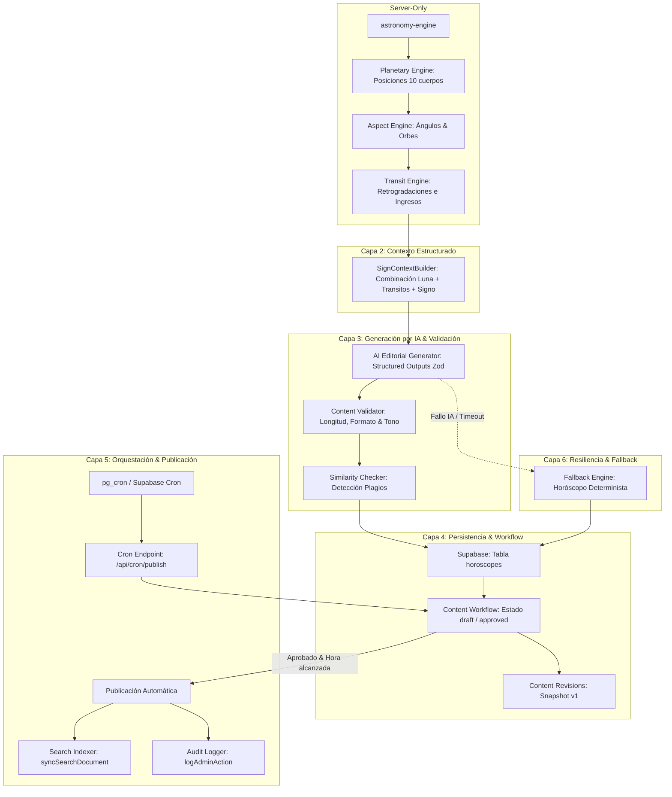

# 03_MAPA_DEPENDENCIAS.md — MAPA DE DEPENDENCIAS Y ORDEN DE CONSTRUCCIÓN

Este documento establece las dependencias técnicas, funcionales y de seguridad del sistema de automatización, fijando el orden obligatorio de implementación.

---

## 1. Diagrama de Flujo Arquitectónico Objetivo



---

## 2. Clasificación de Dependencias

### A. Dependencias Técnicas
1. **`Planetary Engine` depende de `astronomy-engine`** (Librería instalada v2.1.19).
2. **`Aspect Engine` depende de `Planetary Engine`** (Necesita las longitudes eclípticas exactas).
3. **`AI Editorial Generator` depende de `SignContextBuilder`** (No se puede invocar la IA sin un payload de contexto astronómico JSON estructurado previo).
4. **`Cron Endpoint` depende de `auth-middleware.ts` / firma secreta** (No se debe exponer ningún endpoint de ejecución desatendida sin validar token/shared secret).

### B. Dependencias de Datos
1. **`horoscopes` tabla depende de `zodiac-signs.ts`** (Foreign keys / validación de slugs de signos).
2. **`Search Indexer` depende de la tabla `search_documents` y la función RPC `search_site`**.

### C. Dependencias de Seguridad
1. **`Content Workflow` depende de `has_admin_role` / `user_roles`** (Ninguna Server Function o Cron debe saltarse los roles salvo cuando actúe con `service_role` tras validar la firma del Cron).

---

## 3. Orden Obligatorio de Construcción

```text
Paso 1: Motor de Efemérides Planetarias (Planetary Engine)
  ↓
Paso 2: Motor de Aspectos y Orbes (Aspect Engine)
  ↓
Paso 3: Constructor de Contexto por Signo (SignContextBuilder)
  ↓
Paso 4: Esquemas Zod y Generador IA con Structured Outputs
  ↓
Paso 5: Validadores de Calidad y Similitud
  ↓
Paso 6: Adaptador de Workflow para Horóscopos en Base de Datos
  ↓
Paso 7: Endpoint Cron y Orquestación de Publicación Programada
  ↓
Paso 8: Sincronizador Automático del Buscador y Registro de Auditoría
```

---

## 4. Matriz de Paralelización

### Elementos que PUEDEN desarrollarse en paralelo:
* **UI del Panel Administrativo de Horóscopos** (`src/routes/_authenticated/admin/horoscopos.tsx`) se puede maquetar en paralelo mientras se construye el `Planetary Engine`, consumiendo tipos mock.
* **Módulos de Alertas y Logs de Tokens** se pueden construir de forma independiente.

### Elementos que NO DEBEN desarrollarse en paralelo:
* **NO construir los Prompts de la IA** antes de congelar el JSON de salida del `SignContextBuilder`. Si cambia la estructura del contexto astronómico, los prompts quedarán obsoletos.
* **NO implementar el Endpoint Cron** antes de tener completamente funcional y probado el flujo de publicación manual con validación.
