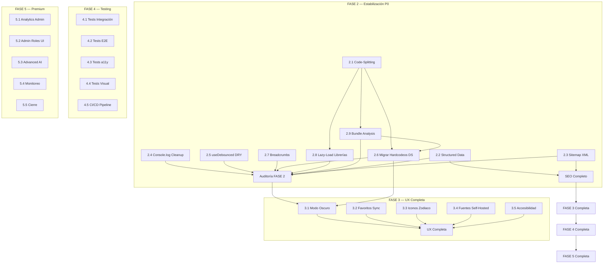

# 02_MASTER_BUILD_ORDER.md — Orden Obligatorio de Construcción

**Versión**: 1.0
**Fecha**: 28/07/2026
**Propósito**: Establecer la secuencia estricta en la que deben construirse, modificarse o completarse los módulos del proyecto. El orden no es negociable sin una decisión documentada en `10_MASTER_DECISION_LOG.md`.

---

## DIAGRAMA DE DEPENDENCIAS GENERAL

---

## ORDEN SECUENCIAL OBLIGATORIO

### FASE 2: Estabilización y Rendimiento (P0)

#### PASO 1 — 2.1: Code-Splitting / Lazy Loading en 54 Rutas
**Orden**: ABSOLUTO PRIMERO
**Por qué es el primero**:
- Sin code-splitting, el bundle es monolítico (~60-70% más grande de lo necesario).
- Todas las tareas de performance (2.6, 2.8, 2.9) dependen de tener la infraestructura de lazy loading funcionando.
- Es el problema #1 identificado en la Auditoría Maestra (POBRE 45/100 en rendimiento).
- `src/routeTree.gen.ts` (1393 líneas) contiene imports estáticos de las 54 rutas. Debe refactorizarse para usar `lazyRouteComponent`.

**Evidencia**: `PERFORMANCE_AUDIT.md` — "Zero code-splitting. All 54 routes eagerly loaded."

**No puede empezar hasta**: FASE 1.5 completada.
**Bloquea**: 2.6, 2.8, 2.9.

---

#### PASO 2 — 2.9: Bundle Analysis con rollup-plugin-visualizer
**Orden**: Inmediatamente después de 2.1
**Por qué aquí**:
- Sin métricas, no se puede medir el impacto real del code-splitting.
- Establece la línea base para todas las optimizaciones futuras.
- Permite identificar chunks problemáticos antes de continuar.

**Depende de**: 2.1 completado.
**Bloquea**: 2.6 (necesita métricas para priorizar componentes a migrar).

---

#### PASO 3 — 2.8: Lazy-Load de Librerías Pesadas (recharts, react-day-picker)
**Orden**: Después de 2.9
**Por qué aquí**:
- recharts (~500KB) y react-day-picker son las dependencias más pesadas.
- Una vez identificadas en bundle analysis, se pueden aislar en chunks separados.
- Solo se usan en rutas de admin (no afectan al usuario general).

**Depende de**: 2.1, 2.9.
**Impacto**: Reduce el bundle inicial para usuarios no-admin.

---

#### PASO 4 — 2.2: Structured Data / JSON-LD
**Orden**: Después de 2.8 (puede paralelizarse con pasos 5, 6, 7)
**Por qué aquí**:
- No depende de cambios en el bundle.
- Es requisito para SEO avanzado en FASE 3.
- Impacto directo en rich snippets de Google (Article, FAQ, BreadcrumbList).

**Evidencia**: `PROJECT_AUDIT_MASTER.md` — "0 ocurrencias de application/ld+json en todo src/".

---

#### PASO 5 — 2.3: Sitemap.xml Dinámico
**Orden**: Paralelo a 2.2
**Por qué aquí**:
- Independiente de otras tareas.
- Necesita listar todas las rutas públicas (ya conocidas).

---

#### PASO 6 — 2.4: Eliminar 54 console.log
**Orden**: Paralelo a 2.2, 2.3, 2.5
**Por qué aquí**:
- Tarea de limpieza independiente.
- Mejora profesionalismo y evita fuga de información en producción.

**Evidencia**: `PERFORMANCE_AUDIT.md` — "54 console.log in production code."

---

#### PASO 7 — 2.5: Extraer useDebounced a src/hooks/
**Orden**: Paralelo a 2.4, 2.2, 2.3
**Por qué aquí**:
- Corrección DRY rápida (0.5h).
- Elimina una de las 4 violaciones arquitectónicas detectadas.

**Evidencia**: `ARCHITECTURE_AUDIT.md` — "Hook useDebounced duplicado en 2 archivos: SearchDialog.tsx:25-32 y buscar.tsx:53-60."

---

#### PASO 8 — 2.6: Migrar ~40+ Hardcodeos de Estilos al Design System
**Orden**: Después de 2.9 (bundle analysis) y preferiblemente después de 2.4
**Por qué al final de FASE 2**:
- Es la tarea más grande de la fase (3-4h).
- Requiere bundle analysis para priorizar componentes más usados.
- Requiere que el sistema de lazy loading esté estable para no romper rutas durante la migración.
- No bloquea otras tareas de FASE 2.

**Depende de**: 2.1, 2.4, 2.9.

---

#### PASO 9 — 2.7: Breadcrumbs
**Orden**: Independiente, puede hacerse en cualquier momento de FASE 2
**Por qué aquí**:
- Componente nuevo que no modifica código existente.
- Mejora UX y SEO (navegación + structured data).

---

#### PASO 10 — 2.10: Auditoría Post-Fase 2
**Orden**: ABSOLUTO ÚLTIMO de FASE 2
**Por qué al final**:
- Verifica que todas las tareas estén completas.
- Valida métricas de bundle contra línea base.
- Confirma que no se introdujeron regresiones.
- Usa `08_PHASE_ACCEPTANCE_CHECKLIST.md` como criterio de cierre.

---

### FASE 3: SEO Avanzado y UX Completa

#### Precondición para FASE 3
FASE 2 totalmente completada y auditada.

#### Orden dentro de FASE 3:

1. **3.4 — Migrar fuentes a self-hosted**: Primero porque afecta a todo el renderizado.
2. **3.1 — Modo oscuro**: Depende de que los hardcodeos estén migrados (2.6). Sin tokens consistentes, el dark mode es imposible.
3. **3.5 — Accesibilidad**: Después del modo oscuro, porque el contraste debe verificarse en ambos temas.
4. **3.2 — Favoritos sincronizados con Supabase**: Independiente.
5. **3.3 — Iconos personalizados de zodíaco**: Independiente, mayor carga de trabajo (8-12h).

---

### FASE 4: Testing y Calidad

#### Precondición para FASE 4
FASE 3 totalmente completada (features estables).

#### Orden dentro de FASE 4:
1. **4.1 — Tests de integración**: Primero, cubren la lógica base.
2. **4.3 — Tests de accesibilidad**: Paralelo a 4.1.
3. **4.2 — Tests E2E**: Después de 4.1, simulan flujos completos.
4. **4.4 — Tests visuales**: Último, verifica regresiones de UI.
5. **4.5 — CI/CD**: Integra todos los tests anteriores en el pipeline.

---

### FASE 5: Premium y Pulido Final

#### Precondición para FASE 5
FASE 4 completada (hay cobertura de tests para detectar regresiones).

#### Orden dentro de FASE 5:
1. **5.2 — Admin Roles UI**: Requiere tests de integración existentes.
2. **5.1 — Analytics Admin Dashboard**: Independiente.
3. **5.3 — Multi-step AI**: Independiente.
4. **5.4 — Monitoreo de errores**: Independiente.
5. **5.5 — Auditoría final y cierre**: ABSOLUTO ÚLTIMO.

---

## MATRIZ DE DEPENDENCIAS

| Tarea | Depende de | Bloquea a | Paralelizable con |
|-------|------------|-----------|-------------------|
| 2.1 Code-Splitting | — | 2.6, 2.8, 2.9 | — |
| 2.9 Bundle Analysis | 2.1 | 2.6 | — |
| 2.8 Lazy-Load Libs | 2.1, 2.9 | — | 2.2, 2.4, 2.5, 2.7 |
| 2.2 Structured Data | — | SEO FASE 3 | 2.3, 2.4, 2.5, 2.7 |
| 2.3 Sitemap | — | — | 2.2, 2.4, 2.5, 2.7 |
| 2.4 Cleanup console.log | — | — | 2.2, 2.3, 2.5, 2.7 |
| 2.5 useDebounced DRY | — | — | 2.2, 2.3, 2.4, 2.7 |
| 2.6 Migrar hardcodeos | 2.1, 2.9 | 3.1 Modo Oscuro | — |
| 2.7 Breadcrumbs | — | — | 2.2, 2.3, 2.4, 2.5 |
| 2.10 Auditoría F2 | TODAS 2.x | FASE 3 | — |
| 3.1 Modo Oscuro | 2.6, 2.10 | — | 3.2, 3.3 |
| 3.4 Fuentes Self-Hosted | 2.10 | — | Todo F3 |
| 3.5 Accesibilidad | 3.1 | — | — |
| 3.2 Favoritos | 2.10 | — | 3.1, 3.3 |
| 3.3 Iconos Zodiaco | 2.10 | — | 3.1, 3.2 |

---

## REGLA DE ORO

**Nunca se avanza a la fase siguiente sin que la auditoría de la fase actual esté aprobada.**

Si una tarea se completa antes que sus dependientes, se documenta como "lista para integración" pero NO se mergea hasta que sus dependencias estén listas.

---

*Orden de construcción derivado de: Auditoría Maestra, PERFORMANCE_AUDIT.md, FINAL_PROJECT_STATUS.md, 03_MAPA_DEPENDENCIAS.md (FASE 1).*