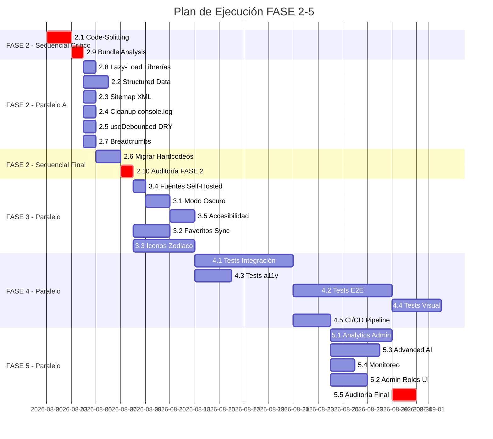

# 03_PARALLEL_EXECUTION_PLAN.md — Plan de Ejecución Paralela

**Versión**: 1.0
**Fecha**: 28/07/2026
**Propósito**: Identificar qué tareas pueden ejecutarse simultáneamente, cuáles requieren secuencia estricta y cuáles bloquean todo el proyecto.

---

## 1. TAREAS QUE PUEDEN DESARROLLARSE SIMULTÁNEAMENTE

### BLOQUE PARALELO A — FASE 2 (Post Code-Splitting)

Una vez que 2.1 (Code-Splitting) está completado, estas 5 tareas pueden ejecutarse en paralelo:

| Grupo | Tareas | Agentes sugeridos | Horas totales |
|-------|--------|-------------------|---------------|
| **A1** | 2.2 Structured Data | Claude | 3-4h |
| **A2** | 2.3 Sitemap XML | Cline | 2-3h |
| **A3** | 2.4 Cleanup console.log | Cline / Claude | 1-2h |
| **A4** | 2.5 useDebounced DRY | Cline | 0.5h |
| **A5** | 2.7 Breadcrumbs | Claude / Codex | 2-3h |

**Justificación**: Ninguna de estas tareas modifica archivos que las otras necesiten. Operan sobre áreas independientes del código:
- 2.2: `src/config/seo.ts` + componentes de ruta (JSON-LD inline)
- 2.3: Nueva ruta `src/routes/sitemap.xml.ts` o server function
- 2.4: Limpieza dispersa en ~20 archivos (sin conflicto de merge si se coordina)
- 2.5: Solo 2 archivos (`SearchDialog.tsx`, `buscar.tsx`) + nuevo `src/hooks/useDebounced.ts`
- 2.7: Nuevo componente `src/components/layout/Breadcrumbs.tsx`

### BLOQUE PARALELO B — FASE 3 (Independientes entre sí)

| Grupo | Tareas | Agentes sugeridos | Horas totales |
|-------|--------|-------------------|---------------|
| **B1** | 3.2 Favoritos Sync | Claude | 4-6h |
| **B2** | 3.3 Iconos Zodiaco | Codex | 8-12h |
| **B3** | 3.4 Fuentes Self-Hosted | Cline | 1-2h |

**Justificación**: Favoritos, iconos y fuentes no comparten dependencias de archivos.

### BLOQUE PARALELO C — FASE 4 (Tests independientes por tipo)

| Grupo | Tareas | Agentes sugeridos | Horas totales |
|-------|--------|-------------------|---------------|
| **C1** | 4.1 Tests Integración | Claude + Cline | 12-16h |
| **C2** | 4.3 Tests a11y | Cline | 4-6h |

**Justificación**: Tests de integración y a11y usan herramientas diferentes (Vitest vs axe-core) y no compiten por archivos.

### BLOQUE PARALELO D — FASE 5 (Features independientes)

| Grupo | Tareas | Agentes sugeridos |
|-------|--------|-------------------|
| **D1** | 5.1 Analytics Admin | Claude |
| **D2** | 5.3 Multi-step AI | Codex |
| **D3** | 5.4 Monitoreo de errores | Cline |

**Justificación**: Analytics dashboard, AI avanzada y monitoreo son módulos completamente independientes.

---

## 2. TAREAS QUE NUNCA DEBEN EJECUTARSE EN PARALELO

### PAR PROHIBIDO 1: 2.1 (Code-Splitting) + 2.6 (Migrar Hardcodeos)

**Razón**: 2.6 modifica componentes que 2.1 está refactorizando para lazy loading. Conflictos de merge masivos garantizados.
**Regla**: 2.6 SOLO puede comenzar cuando 2.1 esté mergeado y verificado.

### PAR PROHIBIDO 2: 2.1 (Code-Splitting) + 2.8 (Lazy-Load Librerías)

**Razón**: 2.8 depende de la infraestructura de lazy loading que 2.1 establece. Si se hacen en paralelo, 2.8 usará imports incorrectos.
**Regla**: Secuencia estricta 2.1 → 2.9 → 2.8.

### PAR PROHIBIDO 3: 2.6 (Migrar Hardcodeos) + 3.1 (Modo Oscuro)

**Razón**: El modo oscuro requiere tokens consistentes. Si se implementa mientras los hardcodeos existen, el dark mode será inconsistente.
**Regla**: 3.1 SOLO después de 2.6 auditado.

### PAR PROHIBIDO 4: Migraciones de Supabase simultáneas

**Razón**: Dos agentes creando migraciones al mismo tiempo generan conflictos de timestamp y orden.
**Regla**: Solo un agente toca `supabase/migrations/` a la vez. Se coordina mediante `10_MASTER_DECISION_LOG.md`.

### PAR PROHIBIDO 5: 2.2 (Structured Data) + cualquier tarea que modifique rutas

**Razón**: JSON-LD se inyecta en los componentes de ruta. Si otro agente modifica la misma ruta, hay conflicto.
**Regla**: Coordinar qué rutas toca cada agente antes de empezar.

---

## 3. TAREAS QUE BLOQUEAN TODO EL PROYECTO

### BLOQUEANTE ABSOLUTO #1: 2.1 Code-Splitting

```
2.1 Code-Splitting
  ├── BLOQUEA → 2.6 Migrar Hardcodeos
  ├── BLOQUEA → 2.8 Lazy-Load Librerías
  ├── BLOQUEA → 2.9 Bundle Analysis
  └── BLOQUEA (indirecto) → FASE 3 (sin métricas de bundle, no se valida performance)
```

**Impacto**: Sin code-splitting, TODO el plan de performance se detiene.
**Estrategia**: Asignar al agente más experimentado con TanStack Router. Tarea prioritaria absoluta.

### BLOQUEANTE ABSOLUTO #2: 2.10 Auditoría Post-Fase 2

```
2.10 Auditoría FASE 2
  └── BLOQUEA → FASE 3 completa
```

**Impacto**: Sin auditoría aprobada, FASE 3 no puede comenzar.
**Estrategia**: Anti-Gravity ejecuta la auditoría. No delega.

### BLOQUEANTE PARCIAL #3: 2.6 Migrar Hardcodeos

```
2.6 Migrar Hardcodeos
  └── BLOQUEA → 3.1 Modo Oscuro
```

**Impacto**: El modo oscuro es imposible sin tokens consistentes.
**Estrategia**: Priorizar la migración de componentes que más impacto tienen en dark mode (layout, cards, botones).

---

## 4. DIAGRAMA DE PARALELISMO



---

## 5. ESTRATEGIA DE COORDINACIÓN

### Antes de empezar cualquier sesión de trabajo:
1. Revisar `10_MASTER_DECISION_LOG.md` para ver qué está en progreso.
2. Anunciar en el log qué tarea se va a tomar.
3. Verificar que ninguna dependencia bloqueante esté incompleta.

### Durante el trabajo:
- Si se necesita modificar un archivo que otro agente está tocando, coordinar en el decision log.
- Las migraciones de Supabase son MUTEX: solo un agente a la vez.

### Al terminar una tarea:
- Marcar como completada en `00_MASTER_EXECUTION_ROADMAP.md`.
- Si la tarea desbloquea otras, notificar en el decision log.

---

## 6. CAPACIDAD MÁXIMA DE PARALELISMO

| Fase | Máx. agentes simultáneos | Cuello de botella |
|------|--------------------------|-------------------|
| FASE 2 (post 2.1) | 4-5 agentes | 2.1 es single-threaded |
| FASE 3 | 3-4 agentes | 3.1 depende de 2.6 |
| FASE 4 | 3 agentes | 4.2 depende de 4.1 |
| FASE 5 | 4 agentes | Todas independientes |

---

*Plan de ejecución paralela derivado de: 02_MASTER_BUILD_ORDER.md, ARCHITECTURE_AUDIT.md, PERFORMANCE_AUDIT.md.*