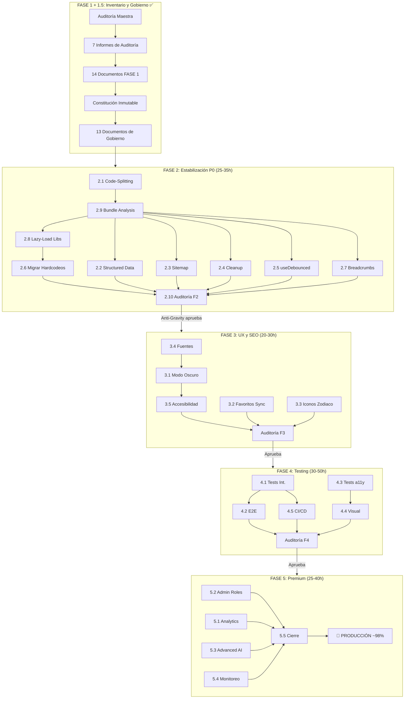

# 09_PROJECT_EXECUTION_CHART.md — Mapa Visual de Ejecución

**Versión**: 2.0
**Fecha**: 28/07/2026
**Propósito**: Representación gráfica integral del ciclo de vida del proyecto.

---

## DIAGRAMA DE EJECUCIÓN

---

## PUNTOS DE CONTROL

| CP | Fase | Auditor | Criterio |
|----|------|---------|----------|
| CP-1 | 1.5 | Anti-Gravity | 13 docs completos |
| CP-2 | 2 | Anti-Gravity | Bundle reducido, rich snippets, 0 hardcodeos |
| CP-3 | 3 | Anti-Gravity | Dark mode, favoritos sync, WCAG AA |
| CP-4 | 4 | Anti-Gravity | Coverage >=70%, CI/CD, E2E pasan |
| CP-5 | 5 | Anti-Gravity | Features completas, sin deuda, docs |

---

## AGENTES POR FASE

| Fase | Principal | Soporte | Auditor |
|------|-----------|---------|---------|
| FASE 2 | Cline | Claude, Codex | Anti-Gravity |
| FASE 3 | Claude | Cline, Codex | Anti-Gravity |
| FASE 4 | Cline + Claude | Codex | Anti-Gravity |
| FASE 5 | Claude + Codex | Cline | Anti-Gravity |

---

*Derivado de: 00_MASTER_EXECUTION_ROADMAP.md, 02_MASTER_BUILD_ORDER.md.*
